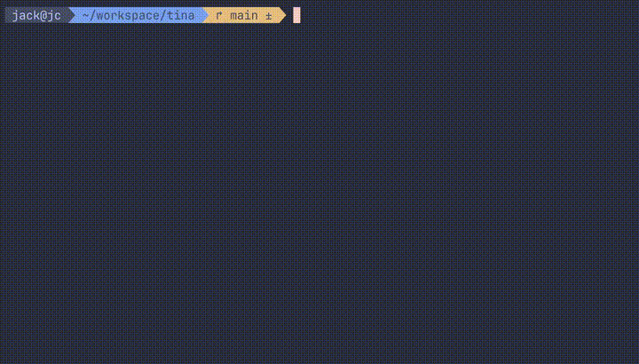

# tina
`tina` is a CLI for interacting with Ollama. It currently supports 3 different models, each with varying size. The largest model is **mixtral:8x7B**, which requires significant vRAM. The next largest model is LlaMa3:8B, and the smallest model is Phi3, which has 3.8B parameters.

## Requirements
- [Ollama](https://ollama.com/)
- One of the [supported models](#supported-ollama-models) installed from Ollama.
- [Python3](https://www.python.org/downloads/)
- Make: `brew install make`
    
## Quickstart
Run the setup script `make setup`. You will need to enter your root user password, as the script will create a symlink in your /user/local/bin directory.

`tina` is prompted by calling her name, and has three different "modes":
```
# standard mode
> tina write a poem about language models

# code mode, which will only return code in markdown style
# some smaller models may return text as well
> tina -c how do i write a for loop in python?

# search mode, which searches google
> tina -s when is the f1 race today?
```
For help, run `tina --help` or `tina -h`.

Example:



## Supported Ollama Models
- LlaMa3:8B
- Phi3:Latest
- Mixtral:8x7B

## Dev Roadmap
- [x] add user input from stdin
- [x] define an action for tina to carry out: display code in a single line
- [x] define an action for tina to carry out: search google
- [x] implement planner and clean up orchestration using claude suggestions
- [x] add logging
- [x] introduce a second, faster model for quicker iteration
- [ ] add system for prompts
- [ ] multiturn?
- [ ] add streaming capability
- [ ] ...
