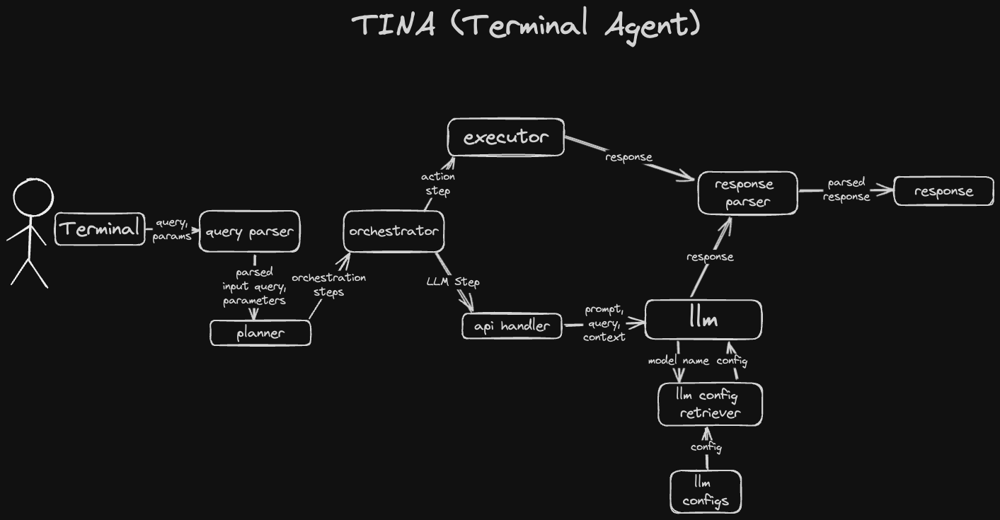

# tina: the terminal agent

Image of current design plan:



## Dev Plan 
1. design classes: UserInput, QueryResponse, LanguageModel
2. design contracts between classes
3. single-turn response


## Introduction
**tina** is a text-based terminal agent. It can serve a range of utilities from the command line.

## Design
The design should be flexible and abstract. I am using Llama3-8b as tina right now, but it should be able to communicate with any LLM running locally, and even with API.

```py
# The user inputs a query along with the command `tina`:
@dataclass
class UserInput:
    query: str

```
To which the model will respond.
```py
@dataclass
class QueryResponse:
    query: str
    response: str   
```

As **tina** evolves, this will get more complicated. Current data model:

```py
# The user inputs a query along with the command `tina`:
@dataclass
class UserInput:
    query: str

class QueryParser(Parser):
    def parse(self, query: str) -> UserInput:

class LLM():
    def generate_response(self, query: UserInput) -> QueryResponse:

class ResponseParser(Parser):
    def parse(self, query_response: QueryResponse) -> str:

@dataclass
class QueryResponse:
    query: str
    response: str   
```
